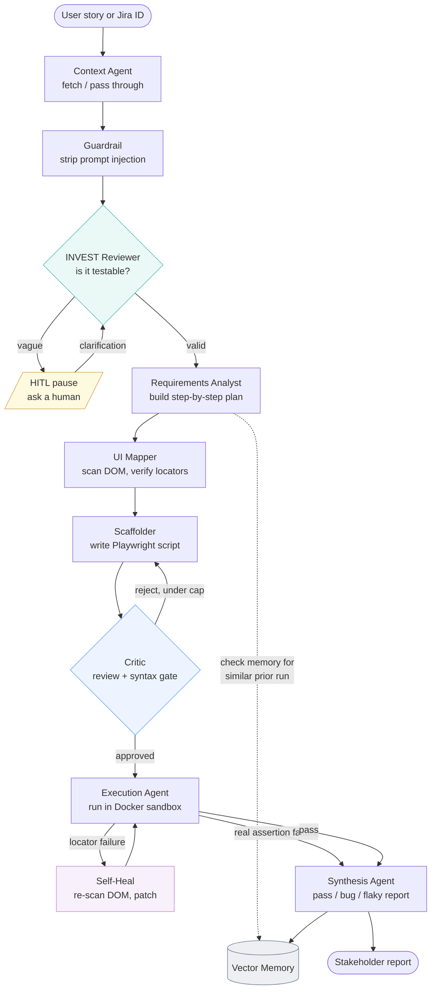
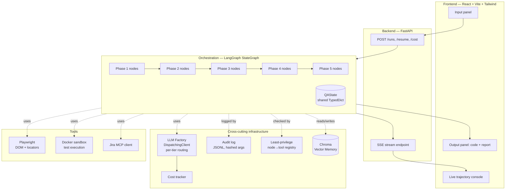
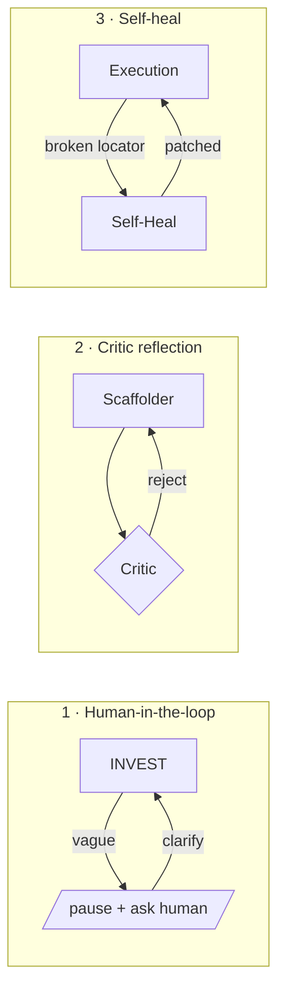

# Intelligent QA Engine

**A multi-agent platform that turns a plain-English user story into a verified, executed browser test — and explains the result in a stakeholder report.**

You give it something like *"As a user, I want to log in with my email and password so I can reach my account."* It validates that the story is testable, plans the test steps, finds the right elements on the real web page, writes a Playwright script, reviews and fixes that script, runs it inside an isolated Docker sandbox, heals broken selectors automatically, and produces a report telling you whether the feature works — all while streaming its reasoning live to a dashboard so you can watch it think.

---

## Table of contents

1. [What problem does this solve?](#what-problem-does-this-solve)
2. [The big picture (for everyone)](#the-big-picture-for-everyone)
3. [End-to-end workflow](#end-to-end-workflow)
4. [System architecture](#system-architecture)
5. [The five phases explained](#the-five-phases-explained)
6. [The three feedback loops](#the-three-feedback-loops)
7. [Technology stack](#technology-stack)
8. [Repository layout](#repository-layout)
9. [Getting started](#getting-started)
10. [Running your first analysis](#running-your-first-analysis)
11. [Configuration & model routing](#configuration--model-routing)
12. [Cost tracking](#cost-tracking)
13. [Governance & evaluation](#governance--evaluation)
14. [Key design decisions](#key-design-decisions)
15. [Known limitations & next steps](#known-limitations--next-steps)
16. [Glossary](#glossary)

---

## What problem does this solve?

Writing automated UI tests is slow, repetitive, and brittle. A human QA engineer reads a requirement, figures out the steps, hunts through the page's HTML for the right buttons and fields, writes a test script, runs it, and — when the app changes and the test breaks — fixes the broken selectors by hand. Then they write up whether a failure was a real bug or just a flaky test.

The Intelligent QA Engine automates that entire chain with a **team of specialized AI agents**, each responsible for one part of the job, coordinated by a state machine. A human only needs to step in when a requirement is too vague to test — and even then, the system pauses and asks, rather than guessing.

---

## The big picture (for everyone)

Think of it as an assembly line staffed by AI specialists. Work moves down the line; at three points the line can loop back on itself to fix problems.

| Specialist | Real-world equivalent | What it does |
|---|---|---|
| **Context Agent** | Business analyst | Reads the story (or pulls it from Jira) |
| **Guardrail** | Security reviewer | Sanitizes the input so it can't hijack the AI |
| **INVEST Reviewer** | Senior QA lead | Judges whether the story is clear enough to test; pauses for a human if not |
| **Requirements Analyst** | Test designer | Breaks the story into concrete test steps |
| **UI Mapper** | Automation engineer | Opens the real page and finds the exact elements to interact with |
| **Scaffolder** | Developer | Writes the actual Playwright test script |
| **Critic** | Code reviewer | Reviews the script and sends it back for fixes until it's sound |
| **Execution Agent** | Test runner | Runs the script in a sealed container |
| **Self-Heal** | Maintenance engineer | Fixes broken element selectors and retries |
| **Synthesis Agent** | Report writer | Explains the outcome: pass, real bug, or flaky |
| **Vector Memory** | Institutional knowledge | Remembers past runs so similar stories are faster next time |

Everything the agents "think" is streamed live to a three-panel dashboard, so a viewer watches the reasoning unfold in real time rather than staring at a spinner.

---

## End-to-end workflow

This is the journey of a single user story from input to report.



**How to read it:** solid arrows are the main flow. The three places where arrows loop *back* are the feedback loops — the system's ability to self-correct. The dotted line to Vector Memory is a read (looking up prior runs); the solid line into it at the end is a write (saving a successful run).

---

## System architecture

The pipeline agents sit on top of shared infrastructure. Everything below the dashed line is cross-cutting — it serves every agent.



**The two contracts that hold it all together:**

- **`QAState`** — a single Python `TypedDict` that every agent reads from and writes to. It carries the story, the plan, the locators, the script, the execution result, the report, and the run status. Because all agents share one state object, adding a new agent is just "add another node that reads and writes `QAState`."
- **`TrajectoryEvent`** — the single shape of every event streamed to the UI (`agent`, `phase`, `type`, `message`, `data`). The frontend simply renders these as they arrive.

These two schemas were frozen early and never changed — which is why the system could grow from one working phase to five without rework.

---

## The five phases explained

### Phase 1 — Context & validation
The story comes in as raw text or a Jira ticket ID. The **Context Agent** fetches Jira details if needed (or passes raw text through). The **Guardrail** treats all incoming text as untrusted and strips anything that looks like an instruction to the AI (prompt-injection defense), wrapping the rest safely. The **INVEST Reviewer** then scores the story against the six INVEST principles (Independent, Negotiable, Valuable, Estimable, Small, Testable). If the story is too vague, the run **pauses and asks a human** rather than guessing.

### Phase 2 — Generation & mapping
The **Requirements Analyst** turns the validated story into a structured list of test steps (`{step_id, intent, action, expected}`). Before it plans, it checks **Vector Memory** for a similar prior run and surfaces it as context. The **UI Mapper** then opens the target page in a headless browser, reads the DOM, and — for each step — asks a model to pick the matching element, then **verifies the selector against the live page**. A selector is only high-confidence if it resolves to *exactly one* element; if it matches zero, many, or the step has no matching element at all, confidence drops and the step is flagged.

### Phase 3 — Script & reflection
The **Scaffolder** turns the plan + verified locators into a runnable Playwright script, using the real target URL and only the resolved locators. The **Critic** reviews it for missing assertions, logic flaws, and — critically — **syntax errors** (a hard `ast.parse` gate blocks any script that won't even compile). If the Critic rejects, it loops back to the Scaffolder with feedback, up to a cap of 3 iterations, then proceeds best-effort.

### Phase 4 — Execution & self-heal
The **Execution Agent** runs the approved script inside an isolated **Docker container** (using the official Playwright image, so Chromium is present). Because the container can't reach the host's `localhost`, target URLs are rewritten to `host.docker.internal` at runtime. If the test fails because a **selector broke**, the **Self-Heal** node re-scans the live page, patches the failing locator, and retries (capped at 3). Crucially, it distinguishes a *broken selector* (heal it) from a *real assertion failure* (a genuine bug — report it, never heal it away).

### Phase 5 — Reporting & memory
The **Synthesis Agent** analyzes the execution result and classifies the outcome as **pass**, **real application bug**, or **flaky/environment issue**, then writes a human-readable stakeholder report. On a successful run, the story, plan, and verified locators are **persisted to Vector Memory** so future similar stories can be recognized and informed by past results.

---

## The three feedback loops

What makes this "agentic" rather than a straight pipeline is that it can loop back to fix its own problems:



Each loop has a **cap** so it can never run forever: the Critic loop stops after 3 revisions, self-heal after 3 attempts (then escalates to a human), and the HITL loop resumes only on human input.

---

## Technology stack

| Layer | Choice | Why |
|---|---|---|
| Orchestration | Python 3.11+, **LangGraph** | Stateful, cyclical multi-agent graphs with conditional edges |
| LLM access | **Anthropic** (Claude Sonnet + Haiku), provider-agnostic factory | Quality where it matters, cheap where volume lives |
| Streaming | **FastAPI + SSE** (`sse-starlette`) | Live trajectory to the browser |
| Frontend | **React + Vite + TypeScript + Tailwind** | Three-panel live dashboard |
| Browser automation | **Playwright** (direct) | DOM reading + locator verification + test execution |
| Vector memory | **Chroma** (local embedder) | Offline, free similarity search for RAG |
| Sandbox | **Docker** (Playwright image) | Isolated, least-privilege test execution |
| Evaluation | Custom evalset + **LLM-as-judge** | Measured INVEST accuracy |

---

## Repository layout

```
qa-engine/
├── backend/
│   ├── app/
│   │   ├── main.py                 # FastAPI app, SSE + run endpoints, Windows event-loop policy
│   │   ├── config.py               # settings + per-tier model routing
│   │   ├── graph/
│   │   │   ├── state.py            # QAState TypedDict  (frozen contract)
│   │   │   ├── builder.py          # LangGraph wiring + conditional edges
│   │   │   └── nodes/              # one file per agent
│   │   ├── llm/
│   │   │   ├── client.py           # DispatchingClient + Anthropic/OpenAI backends
│   │   │   ├── cost_store.py       # per-run cost tally
│   │   │   └── prompts/            # one prompt file per agent
│   │   ├── tools/
│   │   │   ├── browser.py          # Playwright DOM + verified locators
│   │   │   ├── sandbox.py          # Docker execution + URL rewrite
│   │   │   └── mcp_jira.py         # Jira client (fake fixture + real stub)
│   │   ├── memory/vector_store.py  # Chroma persist / retrieve
│   │   ├── streaming/events.py     # TrajectoryEvent + EventEmitter  (frozen contract)
│   │   └── observability/audit.py  # JSONL audit log + least-privilege registry
│   ├── tests/                      # pytest suites per stage + fixtures
│   ├── evals/
│   │   ├── evalset.jsonl           # 10 labeled stories
│   │   └── judge.py                # LLM-as-judge scoreboard
│   ├── run.py                      # entry point (sets Windows Proactor loop before uvicorn)
│   └── requirements.txt
└── frontend/
    ├── src/
    │   ├── App.tsx                 # 3-panel shell + phase rail + status
    │   ├── components/             # InputPanel, TrajectoryPanel, OutputPanel
    │   ├── hooks/useTrajectoryStream.ts   # EventSource → state
    │   └── lib/api.ts              # mirrors backend contracts
    └── package.json
```

---

## Getting started

### Prerequisites
- Python 3.11+
- Node.js 18+
- Docker Desktop (running — required for test execution)
- An Anthropic API key (and/or OpenAI key)

### 1. Backend
```bash
cd backend
python -m venv .venv
# Windows:
.\.venv\Scripts\Activate.ps1
# macOS/Linux:
source .venv/bin/activate

pip install -r requirements.txt
python -m playwright install chromium      # one-time browser download
cp .env.example .env                        # then edit with your keys
```

### 2. Pull the execution sandbox image (one-time)
```bash
docker pull mcr.microsoft.com/playwright/python:v1.61.0-noble
```

### 3. Frontend
```bash
cd frontend
npm install
```

### 4. Run all three services (three terminals)
```bash
# Terminal 1 — backend
cd backend && python run.py                 # http://localhost:8000

# Terminal 2 — a test target (the bundled login fixture)
cd backend/tests/fixtures && python -m http.server 3000

# Terminal 3 — frontend
cd frontend && npm run dev                   # http://localhost:5173
```

> **Note (Windows):** the backend is started with `python run.py`, not `uvicorn` directly. `run.py` sets the Proactor event-loop policy *before* uvicorn starts, which is required for Playwright to spawn its browser subprocess on Windows.

---

## Running your first analysis

1. Open `http://localhost:5173`.
2. Paste a user story, e.g.:
   > As a registered user, I want to log in with my email and password so that I can access my account. Acceptance criteria: entering valid credentials and clicking submit logs me in; both fields are required; an invalid login shows an error message.
3. Set the target URL to `http://localhost:3000/login.html`.
4. Click **Run analysis** and watch the trajectory stream live.

You'll see the phase rail advance 1→5, the trajectory console fill with each agent's reasoning, the generated Playwright script appear in the output panel, and finally a stakeholder report.

**Try a vague story** — e.g. *"Improve the checkout."* — to watch the INVEST reviewer pause and ask for clarification via the inline answer box.

---

## Configuration & model routing

Models are configured **per tier** in `.env`, so the expensive reasoning work and the cheap high-volume work can use different models — even from different providers.

```dotenv
# Reasoning tier — INVEST, Scaffolder, Critic, Synthesis (quality matters)
REASONING_PROVIDER=anthropic
REASONING_MODEL=claude-sonnet-4-6

# Fast tier — UI Mapper DOM extraction (high volume, cost-sensitive)
FAST_PROVIDER=anthropic
FAST_MODEL=claude-haiku-4-5-20251001
```

You can point the fast tier at a cheaper provider (e.g. `FAST_PROVIDER=openai`, `FAST_MODEL=gpt-4o-mini`) while keeping reasoning on Claude Sonnet. The `DispatchingClient` resolves the right backend per call automatically. During pure plumbing development you can drop both tiers to a cheap model; for real runs and demos, put the reasoning tier on a frontier model.

---

## Cost tracking

Every LLM call records its token usage and cost, accumulated per run. The running total streams into the trajectory and is available at:

```
GET /runs/{run_id}/cost   →   { "total_cost_usd": ..., "llm_calls": ... }
```

Typical full run on the Sonnet-reasoning + Haiku-fast split: **~$0.06**. Pricing is defined in a `PRICING` table in `config.py` — **verify these figures against current provider pricing**, since they change and a stale table produces confidently wrong cost reports.

---

## Governance & evaluation

- **Audit log** — every agent step and tool call is written as one JSONL line per run under `data/audit/<run_id>.jsonl`, recording the node, phase, event type, a **SHA-256 hash of the arguments** (never raw values, so story text and secrets aren't logged), timestamp, and outcome.
- **Least-privilege registry** — a `node → allowed-tools` map ensures each agent only touches what it needs (only execution uses the sandbox; only the mapper/self-heal use the browser). Violations are logged (soft enforcement).
- **Evalset + LLM-as-judge** — 10 labeled stories (5 well-formed, 5 vague). Run the scorer:
  ```bash
  cd backend && python -m evals.judge
  ```
  It reports INVEST accuracy and latency, plus an LLM quality score per story. Verified at **100% accuracy (10/10)**.

---

## Key design decisions

- **Walking skeleton first.** The full graph was scaffolded with stub nodes and live streaming *before* any real agent logic, so the risky plumbing (SSE + LangGraph state + HITL pause/resume) was proven once, up front. Every later phase was "swap a stub for real logic."
- **Two frozen contracts.** `QAState` and `TrajectoryEvent` were fixed early and never changed, which let the system grow without ripple-effect rewrites.
- **Verify locators, don't trust them.** The UI Mapper checks every selector against the live DOM (exactly-one-match) rather than trusting the model's self-reported confidence.
- **Heal selectors, never heal bugs.** Self-heal fixes broken locators but explicitly refuses to "fix" a real assertion failure — otherwise the tool would lie about whether the app works.
- **Syntax hard-gate.** The Critic runs `ast.parse` on generated scripts and blocks anything that won't compile, regardless of the LLM's opinion.
- **Provider-agnostic, tier-split LLM routing.** Quality on the reasoning tier, cheap on the high-volume tier, switchable via env.
- **Model capability matters.** Early script-generation problems traced not to code bugs but to an under-powered model on the reasoning tier; moving that tier to a frontier model resolved a whole cluster of issues at once.

---

## Known limitations & next steps

This is a working, verified prototype. Before production use, be aware:

- **Mostly proven against one fixture.** The pipeline works end-to-end, but has been exercised chiefly against a bundled login page. Running it against varied real applications is the next validation step.
- **Self-heal proven in tests, not yet live.** The heal-vs-bug logic is unit-tested and the classification works, but a live locator-break-and-recover demo is still the best thing to build next.
- **Static mapping can't see post-login DOM.** The UI Mapper scans the page as first loaded, so elements that only appear after actions (dashboards, post-submit states) can't be mapped up front — self-heal's live re-scan is the intended remedy.
- **Ephemeral HITL checkpointer.** Development uses LangGraph's in-memory `MemorySaver`; swap to a persistent checkpointer (SQLite/Postgres) before deployment so paused runs survive a restart.
- **Email/inbox steps are inherently un-automatable** via DOM alone; real password-reset flows need email-API testing (e.g. Mailosaur) or mocking.

**Suggested next steps:** a live self-heal demo, runs against real target apps, a persistent checkpointer, and richer locator reuse from Vector Memory (skip re-scanning pages seen before).

---

## Glossary

- **Agent / node** — one specialized step in the pipeline (e.g. the Critic). In code, a function that reads and writes `QAState`.
- **LangGraph** — the framework that wires agents into a graph and routes between them, including loops.
- **QAState** — the shared data object passed through every agent.
- **Trajectory** — the live stream of an agent's reasoning, shown in the dashboard.
- **HITL** — Human-in-the-loop; the system pausing to ask a person.
- **INVEST** — a six-point checklist for whether a user story is well-formed (Independent, Negotiable, Valuable, Estimable, Small, Testable).
- **Locator** — a CSS/XPath selector identifying an element on a page.
- **Reflection loop** — the Scaffolder ↔ Critic cycle that refines the script.
- **Self-heal** — automatically fixing a broken locator and retrying.
- **RAG** — Retrieval-Augmented Generation; here, using remembered past runs to inform new ones.
- **SSE** — Server-Sent Events; the one-way live stream from backend to browser.
- **LLM-as-judge** — using a model to score the system's own outputs against expected labels.